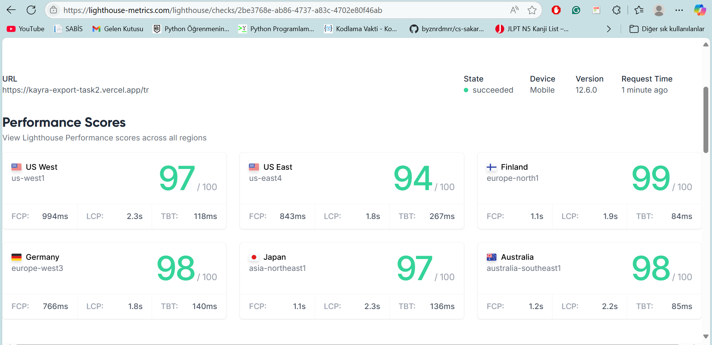

# E-Commerce Frontend (Next.js App Router, i18n, RTK, Tailwind)

A modern, multilingual, performance-oriented storefront built with Next.js (App Router), next-intl for i18n, Redux Toolkit for cart state, Tailwind CSS for styling, and ISR (Incremental Static Regeneration) for fast loads and SEO.

[Live Preview](https://kayra-export-task2.vercel.app/tr)

## Features

1. Multilingual (TR/EN) with next-intl and JSON message catalogs

2. SEO-ready product pages via dynamic generateMetadata

3. Performance

4. ISR caching with revalidate

5. Optimized images via next/image (lazy by default)

6. Client components memoization where it matters

7. Cart with Redux Toolkit

8. Quantity aggregation for duplicate items

9. localStorage persistence across reloads

10. Toast notifications for add/remove/clear (react-toastify)

11. Products & Filters

	Category, search, min/max price, and sort (price-asc|price-desc|title-asc|title-desc)

12. Modern UI

	Unified, understated color palette (neutral grays with subtle accents)

13. Responsive cards, filter bar, and cart layout

## Tech Stack

Next.js 15 (App Router)

next-intl

Redux Toolkit + react-redux

Tailwind CSS + PostCSS

react-toastify

Fake Store API (demo data)

## Getting Started

Node.js >= 18.18 (recommended 20+)

# Install
npm install

# Dev
npm run dev

# Build & start
npm run build
npm start

Next.js images (required)

Allow external product images:
```

// next.config.js
/** @type {import('next').NextConfig} */
const nextConfig = {
  images: {
    remotePatterns: [
      { protocol: 'https', hostname: 'fakestoreapi.com', pathname: '/img/**' }
    ]
  }
}
module.exports = nextConfig
```

## Project Structure (high level)
```
src/
  app/
    [locale]/
      page.tsx            
      products/page.tsx   
      product/[id]/page.tsx 
      layout.tsx           
  components/
    Header.tsx, Footer.tsx
    product/
      ProductCard.tsx
      ProductsFilterBar.tsx
  store/
    cartSlice.ts 
    store.ts, hooks.ts
  i18n/
    locales.ts
  messages/
    en.json, tr.json
  lib/
    fakestore.ts  
```

## Internationalization (next-intl)

Provide translations in src/messages/en.json and src/messages/tr.json.

Wrap locale layouts with NextIntlClientProvider.

Use getTranslations() (server) or useTranslations() (client).

Namespace usage:

Root: t('cart.clear')

With namespace: const t = useTranslations('cart'); t('clear')

## Performance & SEO



### ISR (Incremental Static Regeneration)
Product detail pages fetch with revalidate to cache and refresh in the background.

### Dynamic metadata
generateMetadata builds per-product title and description.

### Client re-render reduction
Memoize components that receive stable props and wrap frequent handlers with useCallback when necessary.

## Cart Behavior

Add/merge: adding the same product increases its quantity

Persist: cart stored in localStorage (survives reloads)

Toasts: feedback via react-toastify

## Design Notes

Neutral base

Accents used sparingly (e.g., subtle amber/rose badges for emphasis)

Consistent button shapes, spacing, hover/focus states

Responsive card grid and filter bar

## Scripts
```
npm run dev      # development

npm run build    # production build

npm start        # start production server

npm run lint     # lint
```
